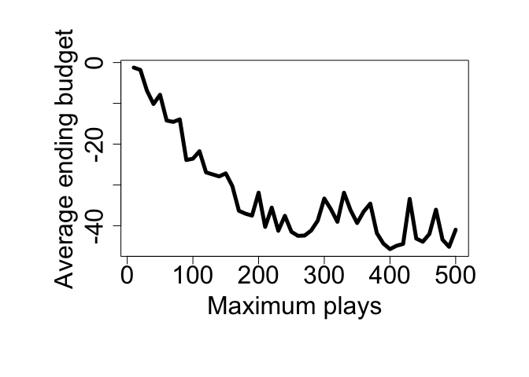
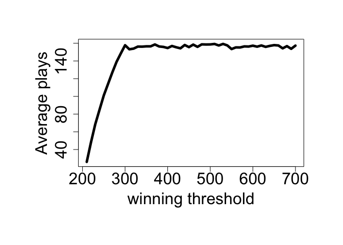

01-roulette
================
Shuyang Lin
9/4/2021

## Introduction to the roulette game

In this case, the roulette game is simplified as fairly and randomly
choosing one number among 1 to 38. There are 38 pockets in total, 18 are
red, 18 are black, and 2 are green. The payout for a bet on black (or
red) is $1 for each $1 wagered. This means that if a gambler bets $1 on
red and the randomly selected pocket is red, then the gambler will get
the original $1 wager and an additional $1 as winnings. [1]

The model we will introduce is a simulation of a classic roulette
strategy named the “Martingale” strategy. The gambler will only wager on
red at every game. If last outcome is red, he will keep wager $1 on red;
if last outcome is black, which means he lost his wager, he will wager
twice the amount he previously wagered, still on red. Here’s a chart for
this strategy:


## Code for simulating

The following code is for simulating the procedure.

First, we make a single spin of the roulette table as a random choice of
a color among red, black and green. Be aware that we weight them in
different amount.

``` r
single_spin <- function(){
  possible_outcomes <- c(rep("red",18), rep("black",18), rep("green",2))
  sample(possible_outcomes, 1)
}
```

As we realize the spin, we could simulate the strategy of deciding the
wager amount by this following code:

``` r
martingale_wager <- function(
  previous_wager
  , previous_outcome
  , max_wager
  , current_budget
){
  if(previous_outcome == "red") return(1)
  min(2*previous_wager, max_wager, current_budget)
}
```

The function takes the output of the previous wager decision and the
last outcome of a spin as an input to decide the amount of wager this
time. It uses an if-else line to copy the options we have discussed
above.

After completing these two functions, we are able to simulate one-time
game process:

``` r
one_play <- function(previous_ledger_entry, max_wager){
  # Create a copy of the input object that will become the output object
  out <- previous_ledger_entry
  out[1, "game_index"] <- previous_ledger_entry[1, "game_index"] + 1
  out[1, "starting_budget"] <- previous_ledger_entry[1, "ending_budget"]
  out[1, "wager"] <- martingale_wager(
    previous_wager = previous_ledger_entry[1, "wager"]
    , previous_outcome = previous_ledger_entry[1, "outcome"]
    , max_wager = max_wager
    , current_budget = out[1, "starting_budget"]
  )
  out[1, "outcome"] <- single_spin()
  out[1, "ending_budget"] <- out[1, "starting_budget"] + 
    ifelse(out[1, "outcome"] == "red", +1, -1)*out[1, "wager"]
  return(out)
}
```

Every time we start a new play, we take the previous game as input of
information. We decide the amount of wager based on the result of the
last play. The result of one play will be stored in a list, including
the game index, the budget balance at the start, the wager amount, the
color of this play, and the budget balance at the end.

Since we have completed one-play, we are able to simulate the whole
process that a gambler walked into the casino, had some starting money,
decided a winning threshold, and started playing the game until he was
satisfied or bankrupt.

``` r
one_series <- function(
  max_games, starting_budget, winning_threshold, max_wager
){
  # Initialize ledger
  ledger <- data.frame(
      game_index = 0:max_games
    , starting_budget = NA_integer_
    , wager = NA_integer_
    , outcome = NA_character_
    , ending_budget = NA_integer_
  )
  ledger[1, "wager"] <- 1
  ledger[1, "outcome"] <- "red"
  ledger[1, "ending_budget"] <- starting_budget
  for(i in 2:nrow(ledger)){
    #browser()
    ledger[i,] <- one_play(ledger[i-1,], max_wager)
    if(stopping_rule(ledger[i,], winning_threshold)) break
  }
  # Return non-empty portion of ledger
  ledger[2:i, ]
}
```

Noticing that in real-world the casino and human beings will not play
the game or wager the money infinitely, we will set a maximum number of
the plays, and a maximum amount of wager that could be spent. Therefore
we have 3 stopping rules and 1 wager rule: the gambler would stop
playing and leave the casino when he played too many plays, went
bankrupt or won enough money; the gambler could not wager more than he
had or the amount the casino set.

``` r
stopping_rule <- function(
  ledger_entry
  , winning_threshold
){
  ending_budget <- ledger_entry[1, "ending_budget"]
  if(ending_budget <= 0) return(TRUE)
  if(ending_budget >= winning_threshold) return(TRUE)
  FALSE
}
```

As the game is for winning money, we simply calculate the total profit
of the whole process by the ending budget of the last play minus the
starting budget before the first play.

``` r
profit <- function(ledger){
  n <- nrow(ledger)
  profit <- ledger[n, "ending_budget"] - ledger[1, "starting_budget"]
  return(profit)
}
```

We may also calculate the amount of the number of plays as the
following:

``` r
number_plays <- function(ledger){
  nrow(ledger)
}
```

Now we could start our simulation. First we should notice we have 4
parameters each time we run a simulation:

|     Parameter      | Description                     |             Starting value             |
|:------------------:|:--------------------------------|:--------------------------------------:|
|     max\_games     | Time threshold for stopping     |                  $200                  |
|  starting\_budget  | Starting budget                 |               200 plays                |
| winning\_threshold | Winnings threshold for stopping | $300 (Starting budget + $100 winnings) |
|     max\_wager     | Casino’s maximum wager          |                  $500                  |

We find two typical gamblers by setting a certain seed. The first one is
a loser who at last ran out of his budget and leave the casino. The
second one is a winner and reached the winning threshold. The x-axis is
the plays’ indexes, and the y-axis is the budget after each play.

### Loser

``` r
require(magrittr) # including a library we need for drawing charts
```

    ## Loading required package: magrittr

``` r
# loser
par(cex.axis=2, cex.lab = 2, mar = c(8,8,4,4))
set.seed(1) # set the seed for random numbers so that the output will be the same every time we run this code
ledger <- one_series(max_games=200, starting_budget=200, winning_threshold=300, max_wager=500)
plot(ledger[,c(1,5)], type = "l", lwd = 5, xlab = "Game Index", ylab = "Budget")
```

<!-- -->

### Winner

``` r
# winner
par(cex.axis=2, cex.lab = 2, mar = c(8,8,4,4))
set.seed(2)
l2 <- one_series(200,200,300,500)
plot(l2[,c(1,5)], type = "l", lwd = 5, xlab = "Game Index", ylab = "Budget")
```

<!-- -->

## Experiment on the parameters

Now we will try to see if changing the parameter will show difference of
outcomes. Each time we will vary only one parameter based on
(200,200,300,500) we used before. We will generate 300 gamblers with
seeds from 1 to 300. It’s a game for earning, so we will focus on the
budget at last.

### Changing the maximum amount of plays

``` r
ave_earnings1 <- vector()
ave_times1 <- vector()
max_plays <- vector()
for(j in 1:50) {
  max_plays[j] <- j*10
  sum_earning <- 0
  sum_time <- 0
  for(i in 1:300) {
    set.seed(i)
    game_result <- one_series(j*10,200,300,500)
    sum_earning <- sum_earning + profit(game_result)
    sum_time <- sum_time + number_plays(game_result)
  }
  ave_earnings1[j] <- sum_earning/300
  ave_times1[j] <- sum_time/300
}
```

``` r
par(cex.axis=2, cex.lab = 2, mar = c(8,8,4,4))
plot(max_plays, ave_earnings1, type = "l", lwd = 5, xlab = "Maximum plays", ylab = "Average ending budget")
```

<!-- -->

We increased the maximum play by 10 each time from 10 to 500, showing a
reduction of average ending budget among 300 gamblers.

Besides, we try calculating the average play times:

``` r
par(cex.axis=2, cex.lab = 2, mar = c(8,8,4,4))
plot(max_plays, ave_times1, type = "l", lwd = 5, xlab = "Maximum plays", ylab = "Average plays")
```

<!-- -->

### Changing the starting budget

``` r
ave_earnings2 <- vector()
starting_budget <- vector()
ave_times2 <- vector()
for(j in 1:50) {
  starting_budget[j] <- j*10
  sum_earning <- 0
  sum_time <- 0
  for(i in 1:300) {
    set.seed(i)
    game_result <- one_series(200,j*10,300,500)
    sum_earning <- sum_earning + profit(game_result)
    sum_time <- sum_time + number_plays(game_result)
  }
  ave_earnings2[j] <- sum_earning/300
  ave_times2[j] <- sum_time/300
}
```

``` r
par(cex.axis=2, cex.lab = 2, mar = c(8,8,4,4))
plot(starting_budget, ave_earnings2, type = "l", lwd = 5, xlab = "Starting budget", ylab = "Average ending budget")
```

<!-- -->

Still we increased the starting budget by 10 each time from 10 to 500,
showing a curve of average ending budget among 300 gamblers. After the
starting budget is more than 240, we find the profit increasing again.

Besides, we try calculating the average plays

``` r
par(cex.axis=2, cex.lab = 2, mar = c(8,8,4,4))
plot(starting_budget, ave_times2, type = "l", lwd = 5, xlab = "Starting budget", ylab = "Average plays")
```

<!-- -->

### Changing the winning threshold

``` r
ave_earnings3 <- vector()
winning_threshold <- vector()
for(j in 1:50) {
  winning_threshold[j] <- j*10
  sum_earning <- 0
  for(i in 1:300) {
    set.seed(i)
    sum_earning <- sum_earning + profit(one_series(200,200,j*10,500))
  }
  ave_earnings3[j] <- sum_earning/300
}
```

``` r
par(cex.axis=2, cex.lab = 2, mar = c(8,8,4,4))
plot(winning_threshold, ave_earnings3, type = "l", lwd = 5, xlab = "winning threshold", ylab = "Average ending budget")
```

<!-- -->

The winning threshold is interesting. It did not show a difference when
less than 200. After that, it made the budget decrease rapidly. And
after 300, it again made no differences.

### Changing the maximum wager

``` r
ave_earnings4 <- vector()
max_wager <- vector()
for(j in 1:50) {
  max_wager[j] <- j*10
  sum_earning <- 0
  for(i in 1:300) {
    set.seed(i)
    sum_earning <- sum_earning + profit(one_series(200,200,300,j*10))
  }
  ave_earnings4[j] <- sum_earning/300
}
```

``` r
par(cex.axis=2, cex.lab = 2, mar = c(8,8,4,4))
plot(max_wager, ave_earnings4, type = "l", lwd = 5, xlab = "Maximum wager", ylab = "Average ending budget")
```

<!-- -->

The result of changing maximum wager is similar to the starting budget.

## Conclusion and limitation

As a result, we may see that no matter how we change the parameters, the
average profit is always less than 0, which means we are expected to
lose most the time. The situation may vary among different participants,
different rules and different time. Do remember this case is a
simulation only. We simplify the spinning process as a random pick of a
number among 1 to 38, but in real-world the table, the ball, and the
people turning the spin, all those aspects will count. The random
library in R is also based on pseudorandomness. Everything we calculated
is just within an ideal model.

[1] <https://github.com/thomasgstewart/data-science-5620-fall-2021/blob/master/deliverables/01-roulette.md>
