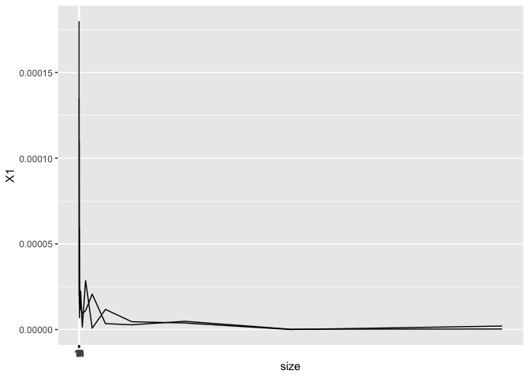
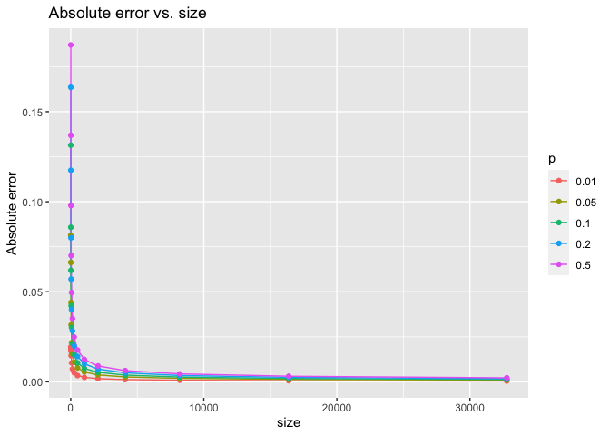

Monte Carlo Error
================
Shuyang Lin
9/8/2021

# Sorry for missing due date, this version is an uncompleted one.

``` r
library(tidyverse)
```

    ## ── Attaching packages ─────────────────────────────────────── tidyverse 1.3.1 ──

    ## ✓ ggplot2 3.3.5     ✓ purrr   0.3.4
    ## ✓ tibble  3.1.3     ✓ dplyr   1.0.7
    ## ✓ tidyr   1.1.3     ✓ stringr 1.4.0
    ## ✓ readr   2.0.1     ✓ forcats 0.5.1

    ## ── Conflicts ────────────────────────────────────────── tidyverse_conflicts() ──
    ## x dplyr::filter() masks stats::filter()
    ## x dplyr::lag()    masks stats::lag()

``` r
library(ggplot2)
```

``` r
# generate testing result
set.seed(1)
test_size <- 100000
size <- NA
for(i in 2:15) {
  size[i-1] <- 2**i
}
prob <- c(0.01,0.05,0.1,0.2,0.5)
data <- data.frame(matrix(NA,70,4))
colnames(data) <- c("size","p", "abs_error", "rel_error")
count <- 1
for(i in 1:14) {
  for(j in 1:5) {
    data[count,1] <- size[i]
    data[count,2] <- prob[j]
    temp <- rbinom(test_size,size[i],prob[j])
    data[count, 3] <- mean(abs(temp/size[i] - prob[j]))
    data[count, 4] <- data[count,3]/prob[j]
    count <- count + 1;
  }
}

data$p <- factor(data$p)
```

``` r
(g1 <- ggplot(data, aes(x=log(size,2),y=abs_error, factor=p)) + geom_line(aes(color=p)) + geom_point(aes(color=p)))
```

<!-- -->

``` r
(g2 <- ggplot(data, aes(x=log(size,2),y=rel_error, factor=p)) + geom_line(aes(color=p)) + geom_point(aes(color=p)))
```

<!-- -->
