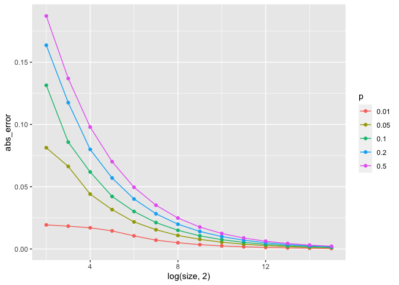

Monte Carlo Error
================
Shuyang Lin
9/8/2021

# Sorry for missing due date, this version is an uncompleted one.

``` r
library(tidyverse)
```

    ## ── Attaching packages ─────────────────────────────────────── tidyverse 1.3.1 ──

    ## ✓ ggplot2 3.3.5     ✓ purrr   0.3.4
    ## ✓ tibble  3.1.3     ✓ dplyr   1.0.7
    ## ✓ tidyr   1.1.3     ✓ stringr 1.4.0
    ## ✓ readr   2.0.1     ✓ forcats 0.5.1

    ## ── Conflicts ────────────────────────────────────────── tidyverse_conflicts() ──
    ## x dplyr::filter() masks stats::filter()
    ## x dplyr::lag()    masks stats::lag()

``` r
library(ggplot2)
```

``` r
# generate testing result
set.seed(1)
test_size <- 100000
size <- NA
for(i in 2:15) {
  size[i-1] <- 2**i
}
prob <- c(0.01,0.05,0.1,0.2,0.5)
Abs_Error <- matrix(NA,14,5)
Rel_Error <- matrix(NA,14,5)
for(i in 1:14) {
  for(j in 1:5) {
    temp <- rbinom(test_size,size[i],prob[j])
    Abs_Error[i,j] <- abs(mean(temp)/size[i] - prob[j])
    Rel_Error[i,j] <- abs((mean(temp)/size[i] - prob[j])/prob[j])
  }
}

Abs_Error <- data.frame(Abs_Error)
Rel_Error <- data.frame(Rel_Error)
```

``` r
ggplot() + geom_line(Abs_Error,mapping = aes(size, X1)) + geom_line(Abs_Error,mapping = aes(size, X2)) + scale_x_log10() + scale_x_continuous(breaks=seq(0,16,1))
```

    ## Scale for 'x' is already present. Adding another scale for 'x', which will
    ## replace the existing scale.

<!-- -->

``` r
ggplot(Rel_Error,aes(log(size,2), X1)) + geom_line()
```

<!-- -->
