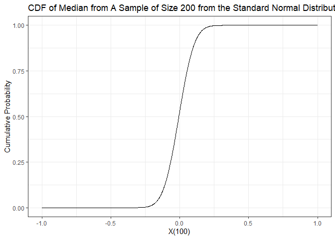
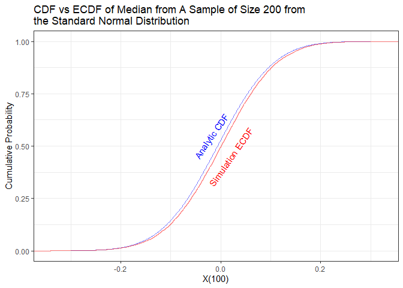
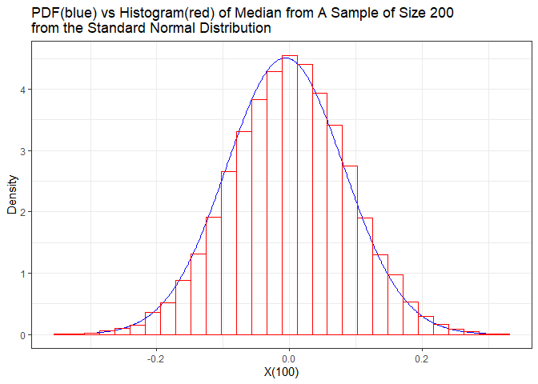
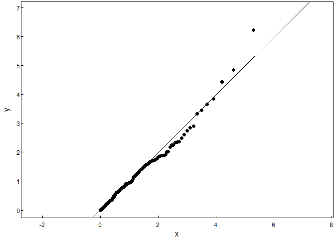
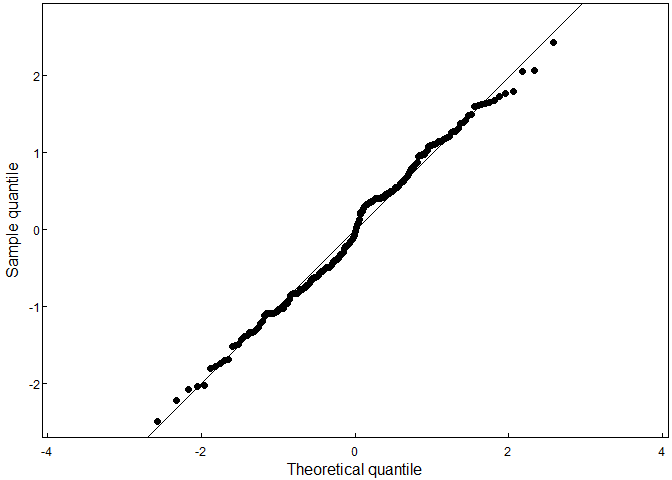
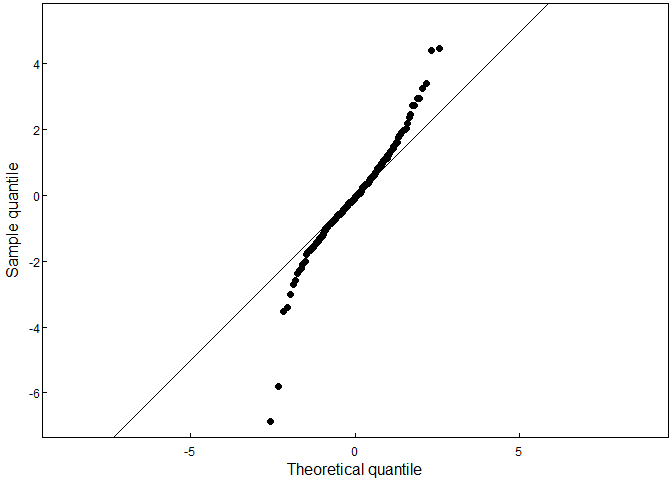
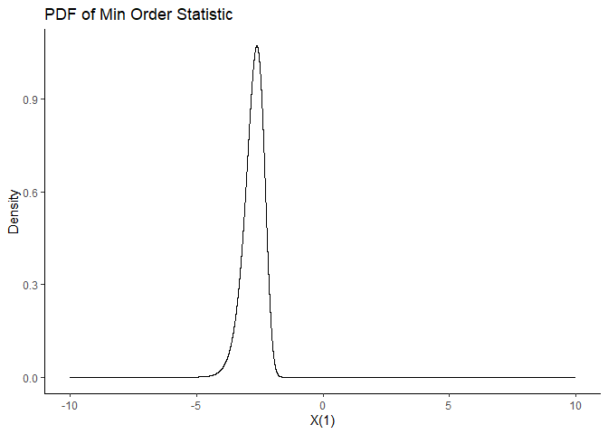

06-order-statistics
================
Shuyang Lin
10/21/2021

# Which quantiles of a continuous distribution can one estimate with more precision?

The median is an important quantity in data analysis. It represents the
middle value of the data distribution. Estimates of the median, however,
have a degree of uncertainty because (a) the estimates are calculated
from a finite sample and (b) the data distribution of the underlying
data is generally unknown. One important roles of a data scientist is to
quantify and to communicate the degree of uncertainty in his or her data
analysis.

# Background Knowledge

The *k*<sup>*t**h*</sup> **Order statistic** is equal to the
*k*<sup>*t**h*</sup> smallest value of a statistical sample.[1] When the
values of the random variable *X* is marked as *X*<sub>1</sub>,
*X*<sub>2</sub>, …, *X*<sub>*n*</sub>, the corresponding order
statistics are marked as *X*<sub>(1)</sub>, *X*<sub>(2)</sub>, …,
*X*<sub>(*n*)</sub>.

Given a sample of absolutely continuous random variable *X*,
*P*(*X*<sub>(*k*)</sub> ≤ *x* &lt; *X*<sub>(*k* + 1)</sub>) is
equivalent to the probability that *k* samples less than or equal to
*x*, and *n* − *k* samples greater than *x*. Therefore, it’s similar to
the binomial distribution, and the probability could be given as below:

*P*(*X*<sub>(*k*)</sub> ≤ *x* &lt; *X*<sub>(*k* + 1)</sub>) = *C*<sub>*n*</sub><sup>*k*</sup>\[*F*(*x*)\]<sup>*k*</sup>\[1 − *F*(*x*)\]<sup>*n* − *k*</sup>
Then, since each *X*<sub>*k*</sub> is independent and identically
distributed, the event {*X*<sub>(*k*)</sub> ≤ *x*} is equivalent to
$\\bigcup\\limits\_{i=k}^n\\{X\_{(i)}\\leq x\\}$ because each
{*X*<sub>(*k*)</sub> ≤ *x* &lt; *X*<sub>(*k* + 1)</sub>} is exclusive.

Therefore, the CDF of the order statistic is given as below:

$$ F\_{X\_{(k)}}(x) =\\sum\_{i=k}^nC\_n^i\[F(x)\]^i\[1-F(x)\]^{n-i}$$

The PDF could be derived from the CDF above.

# Solutions to Questions

-   **Q1: Begin with the median from a sample of N = 200 from the
    standard normal distribution. Write an R function that is the
    density function for the median in this sample. Note that the 100th
    order statistic is approximately the median, and use the order
    statistic formula discussed in class. Generate a plot of the
    function.**

The function could be given by the PDF of the order statistics:

*f*<sub>*X*<sub>(*k*)</sub></sub>(*x*) = *k**C*<sub>*n*</sub><sup>*k*</sup>*f*<sub>*X*</sub>(*x*)\[*F*<sub>*X*</sub>(*x*)\]<sup>*k* − 1</sup>\[1 − *F*<sub>*X*</sub>(*x*)\]<sup>*n* − *k*</sup>

Where *k* = 100, *n* = 200, *f*<sub>*X*</sub>(*x*) is the PDF of the
standard normal distribution and *F*<sub>*X*</sub>(*x*) is the CDF.

``` r
dorder <- function(x){
  100*choose(200, 100)*pnorm(x)^99*(1-pnorm(x))^100*dnorm(x)
}
```

And we draw the plot of it:

``` r
sample <- data.frame(seq(-1,1,0.001))
colnames(sample) <- c('median')
sample$dorder <- dorder(sample$median)
(
  dorder_plot <- ggplot(sample, aes(x=median, y=dorder)) + geom_line() + theme_bw() +
                labs(
                  title = 'PDF of Median from A Sample of Size 200 from the Standard Normal Distribution',
                  x = 'X(100)',
                  y = 'Density'
                )
)
```

<!-- -->

-   **Q2: Write an R function that is the probability function for the
    median in this sample. Use the order statistic formula discussed in
    class. Generate a plot of the function.**

The CDF is also given by the PDF of the order statistics:

$$F\_{X\_{(r)}}(x) = \\sum\_{i=k}^{n}C\_n^k\[F\_X(x)\]^i\[1-F\_X(x)\]^{n-i}$$

Where *k* = 100, *n* = 200, and *F*<sub>*X*</sub>(*x*) is the CDF of the
standard normal distribution. In fact, it is a binomial distribution
with the *p* given by the PDF of the standard normal distribution
(marked as *P*(*X* ≤ *k*)):
*F*<sub>*X*<sub>(*r*)</sub></sub>(*x*) = *P*(*X* ≥ *k*) = 1 − *P*(*X* ≤ *k* − 1)
The Code is:

``` r
porder <- function(x){
  1 - pbinom(99, 200, pnorm(x))
}

# draw the plot
sample$porder <- porder(sample$median)
(
  porder_plot <- ggplot() + geom_line(sample, mapping = aes(x=median, y=porder)) + theme_bw() +
                labs(
                  title = 'CDF of Median from A Sample of Size 200 from the Standard Normal Distribution',
                  x = 'X(100)',
                  y = 'Cumulative Probability'
                )
)
```

<!-- -->

-   **Q3: Write an R function that is the quantile function for the
    median in this sample. (You have several options for how to write
    this function.) Generate a plot of the function.**

We know the quantile function is the inverse function of PDF. Therefore,
we solve the equation that is given the quantile *p* and regards the
medians as unknown:
*F*<sub>*X*<sub>(*r*)</sub></sub>(*x*) = *p*

Here we could introduce the uniroot() function in R. It could help us
solve the equation in a given interval, which could be \[-100, 1\] in
our case.

``` r
qorder <- function(p){
  uniroot(function(x){porder(x) - p}, c(-100, 100))$root
}

# draw the plot
qsample <- data.frame(seq(0.01,0.99,0.001))
colnames(qsample) <- c('q')
qsample$median <- sapply(qsample$q, qorder)
(
  qorder_plot <- ggplot() + geom_line(qsample, mapping = aes(x=q,y=median)) + theme_bw() +
                labs(
                  title = 'Quantile Function of Median from A Sample of Size 200 from the Standard Normal Distribution',
                  x = 'Probability',
                  y = 'X(100)'
                )
)
```

<!-- -->

-   **Q4: Simulate the sampling distribution for the median. Create a
    plot of the empirical CDF (ECDF). Overlay the plot of the ECDF with
    a plot of the CDF.**

We first generate 10,000 samples of size 200, and record their median,
then we draw the plot using stat\_ecdf() function in ggplot2:

``` r
set.seed(1)
medsample <- sapply(lapply(matrix(200,10000,1), rnorm),median)

# draw the plot
(
  medsample_plot <- ggplot() +
    geom_line(aes(x=seq(-0.3, 0.3, 0.001), y=porder(seq(-0.3, 0.3, 0.001))), alpha = 0.5, color = 'blue') + geom_text(aes(x=-0.02, y = 0.55), angle = 55, label = 'Analytic CDF',color = 'blue')+
    theme_bw() + 
    stat_ecdf(aes(x=medsample), color = 'red', alpha = 0.5) +
    geom_text(aes(x=0.02, y = 0.45), angle= 55,label = 'Simulation ECDF', color = 'red')+
    labs(
      title = 'CDF vs ECDF of Median from A Sample of Size 200 from\nthe Standard Normal Distribution',
      x = 'X(100)',
      y = 'Cumulative Probability'
    ) +
    scale_x_continuous()
)
```

<!-- -->

-   **Q5: Using the simulated sampling distribution from the previous
    question, create a histogram (on the density scale). Overlay the
    histogram with a plot of the density function.**

The plot is given by the code below:

``` r
(
  medsample_plot2 <- ggplot() + 
                geom_line(
                  aes(
                    x=seq(min(medsample),max(medsample),0.001),
                    y = dorder(seq(min(medsample),max(medsample),0.001))
                  ),
                  color='blue'
                )+ 
                geom_histogram(
                  aes(x=medsample, y =..density..),
                  color = 'red', fill=NA, bins = 30
                )+
                theme_bw() +
                labs(
                  title = 'PDF(blue) vs Histogram(red) of Median from A Sample of Size 200\nfrom the Standard Normal Distribution',
                  x = 'X(100)',
                  y = 'Density'
                )
)
```

<!-- -->

-   **Q6: One very common way to compare a random sample to a
    theoretical candidate distribution is the QQ plot. It is created by
    ploting quantiles of the theoretical distribution on the x-axis and
    empirical quantiles from the sample on the y-axis.**

**If sample and theoretical quantiles come from the same distribution,
then the plotted points will fall along the line y = x, approximately.
Here are two examples when the sample and theoretical quantiles came
from the same distribution.**

``` r
random_sample <- rexp(200)
q_candidate <- qexp

x <- q_candidate((1:200)/200)
y <- quantile(random_sample, probs = (1:200)/200)

tgsify::plotstyle(style = upright)
plot(x,y, asp = 1)
abline(0,1)
```

<!-- -->

``` r
random_sample <- rnorm(200)
q_candidate <- qnorm

x <- q_candidate((1:200)/200)
y <- quantile(random_sample, probs = (1:200)/200)

tgsify::plotstyle(style = upright)
plot(x,y, asp = 1, xlab = "Theoretical quantile", ylab = "Sample quantile")
abline(0,1)
```

<!-- -->

**Here is an example when the sample distribution does not match with
the theoretical distribution. The sample distribution is t3 where as the
theoretical distribution is N(0, 1). Notice the deviation from y = x.**

``` r
random_sample <- rt(200, df = 3)
q_candidate <- qnorm

x <- q_candidate((1:200)/200)
y <- quantile(random_sample, probs = (1:200)/200)

tgsify::plotstyle(style = upright)
plot(x,y, asp = 1, xlab = "Theoretical quantile", ylab = "Sample quantile")
abline(0,1)
```

<!-- -->

**The deviation occurs despite the fact that the two distributions are
similar.For the assignment, generate a QQ plot for the simulated data of
the median relative to the known sampling distribution of the
median.Does the simulated data agree with the theoretical sampling
distribution?**

Lets draw the qqplot first. The vector **qsample**, which is the
theoretical quantiles, are given by the qorder() function in the
solution to Q3:

``` r
sampleq <- sapply(seq(0.01, 0.99, 0.001), quantile, x=medsample)
(
  qqplot <- ggplot() +
              geom_point(aes(x=qsample$median, y=sampleq)) +
              labs(
                title='QQ Plot of the Median',
                x='Theoretical Quantile',
                y='Sample Quantile'
              ) +
              geom_abline(slope=1,intercept=0)+
              theme_classic()
)
```

<!-- -->

We could see though they are nearly the same, the points are nearly
lying on the line *y* = *x*, which indicates that they are not exactly
equal, but the simulated data does agree with the theoretical sampling
distribution, sharing a similar distribution.

-   **Q7: Modify the dorder, porder, and qorder functions so that the
    functions take a new parameter k (for the **
    *k*<sup>*t*<sup>*h*</sup></sup> **order statistic) so that the
    functions will work for any order statistic and not just the
    median.**

The functions are given below, replacing 100 with k, 200-100 with 200-k,
and 99 with k-1:

``` r
dorder <- function(x, k){
  k*choose(200, k)*pnorm(x)^(k-1)*(1-pnorm(x))^(200-k)*dnorm(x)
}

porder <- function(x, k){
  1 - pbinom(k-1, 200, pnorm(x))
}

qorder <- function(p, k){
  uniroot(function(x){porder(x, k) - p}, c(-100, 100))$root
}
```

-   **Q8: Generate the QQ plot for simulated data from the sampling
    distribution of the sample max and the theoretical largest order
    statistic distribution.**

The sample max is given as below:

``` r
maxsample <- sapply(lapply(matrix(200,10000,1), rnorm),max)
```

Then we use qorder() to generate the theoretical largest order
statistic, calculate the quantiles, and draw a QQ plot:

``` r
(
  qqplot_max <- ggplot() +
              geom_point(
                aes(
                  x=sapply(seq(0.01,0.99,0.001), qorder, k=200),
                  y=quantile(maxsample, probs=seq(0.01,0.99,0.001))
                )
              ) +
              labs(
                title='QQ Plot of the Max',
                x='Theoretical Largest Order Statistic Quantile',
                y='Sample Max Quantile'
              ) +
              geom_abline(slope=1,intercept=0)+
              theme_classic()
)
```

<!-- -->

They are nearly the same.

-   **Q9: Modify the dorder, porder, and qorder functions so that the
    functions take new parameters dist and … so that the functions will
    work for any continuous distribution that has d and p functions
    defined in R.**

The functions are modified as below:

``` r
dorder <- function(x, k, dist='norm'){
  f <- eval(parse(text=paste0("d",dist)))
  F <- eval(parse(text=paste0("p",dist)))
  k*choose(200, k)*F(x)^(k-1)*(1-F(x))^(200-k)*f(x)
}

porder <- function(x, k, dist='norm'){
  1 - pbinom(k-1, 200, eval(parse(text=paste0("p",dist)))(x))
}

qorder <- function(p, k, dist='norm'){
  uniroot(function(x){porder(x, k, dist) - p}, c(-100, 100))$root
}
```

-   **Q10: Use the newly modified functions to plot the probability and
    density functions for the sample min (N = 200).**

We need to use dorder() for density:

``` r
# density
(
  density_min <- ggplot() +
                  geom_line(
                    aes(
                      x=seq(-10,10,0.001),
                      y = dorder(seq(-10,10,0.001),1)
                    )
                  ) +
                  labs(
                    title='PDF of Min Order Statistic',
                    x='X(1)',
                    y='Density'
                  ) +
                  theme_classic()
)
```

<!-- -->

…And porder() for probability

``` r
# probability
(
  probability_min <- ggplot() +
                      geom_line(
                        aes(
                          x=seq(-10,10,0.001),
                          y=porder(seq(-10,10,.001),1)
                        )
                      ) +
                      labs(
                        title='CDF of Min Order Statistic',
                        x='X(1)',
                        y='Probability'
                      ) +
                      theme_classic()
)
```

<!-- -->

# Reference Links

[1] [Order statistic -
Wikipedia](https://en.wikipedia.org/wiki/Order_statistic)
