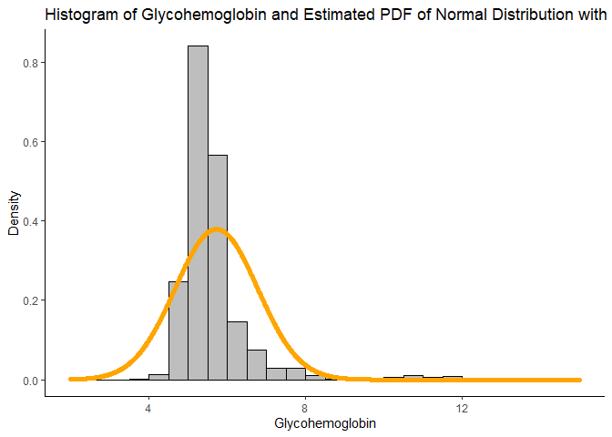
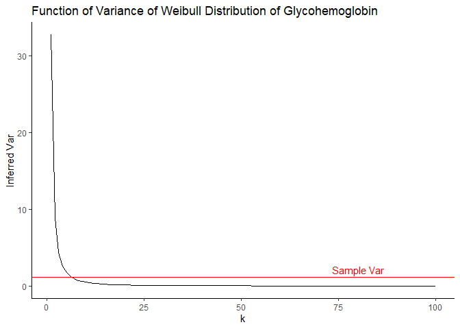
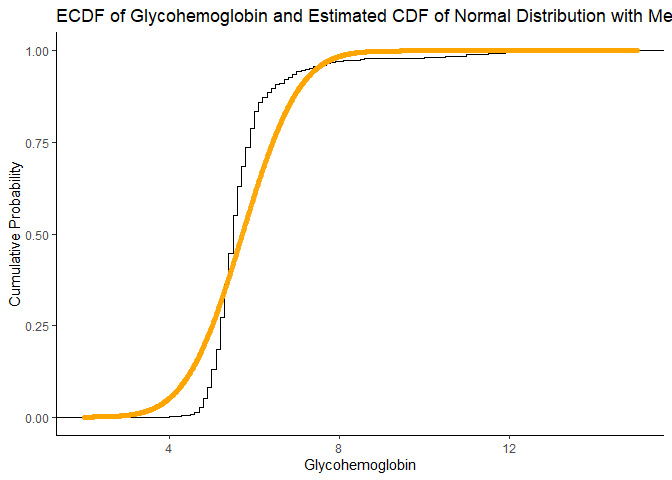
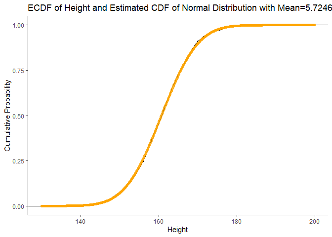

07-mle-mm
================
Shuyang Lin
11/4/2021

# Introduction

To construct a model, we usually use Maximum Likelihood and Method of
Moments.In this blog, we would model (a) Glycohemoglobin and (b) Height
of adult females. The data will be from National Health and Nutrition
Examination Survey 2009-2010 (NHANES), available from the Hmisc package.
We will compare and contrast the two methods in addition to comparing
and contrasting the choice of underlying distribution.

The data is imported as below:

``` r
require(dplyr)
Hmisc::getHdata(nhgh)
d1 <- nhgh %>% 
  filter(sex == "female") %>% 
  filter(age >= 18) %>% 
  select(gh, ht) %>% 
  filter(1:n()<=1000)
```

# Method of Moments

First we will calculate the means and variances:

``` r
# calculate the mean and variance of the sample
xbar_gh <- mean(d1$gh)
xbar_ht <- mean(d1$ht)
var_gh <- var(d1$gh)
var_ht <- var(d1$ht)
```

Then, we could estimate the parameters based on Method of Moments to fit
the data: normal distribution, Gamma distribution, and Weibull
distribution.

## Normal distribution

If the data follows the normal distribution, then we could assume that
*X* ∼ *N*(*x**b**a**r*, *v**a**r*<sup>0.5</sup>).

Therefore, the parameters of the normal distribution will be the same as
the means and standard errors of the samples.

``` r
# normal distribution
(sd_gh <- sd(d1$gh))
```

\[1\] 1.052246

``` r
(sd_ht <- sd(d1$ht))
```

\[1\] 7.320161

# Gamma distribution

For Gamma distribution, we could simply calculate the parameters with
the formulas:

$$ Shape = \\frac{xbar^2}{var}$$

$$ Scale = \\frac{var^2}{xbar}$$

Therefore, the parameters of Gamma Distribution is:

``` r
# gamma distribution
(shape_gh <- xbar_gh^2/var_gh)
```

\[1\] 29.59754

``` r
(scale_gh <- var_gh/xbar_gh)
```

\[1\] 0.1934147

``` r
(shape_ht <- xbar_ht^2/var_ht)
```

\[1\] 482.1886

``` r
(scale_ht <- var_ht/xbar_ht)
```

\[1\] 0.333359

-   Overlay estimated pdf onto histogram

First one for Glycohemoglobin:

``` r
(
  pdf_gh <- ggplot() +
                geom_histogram(d1, mapping=aes(x=gh,y=..density..),
                               breaks=seq(2,15,0.5),color='black',fill='grey') + 
                geom_point(
                  mapping = aes(
                    x=seq(2, 15, 0.01), 
                    y=dnorm(seq(2,15,0.01),
                    mean=xbar_gh,
                    sd=var_gh^.5
                  )),
                  color = 'orange',
                  alpha=.5
                ) +
                labs(
                  title = 'Histogram of Glycohemoglobin and Estimated PDF of Normal Distribution with Mean=5.7246 and SD=1.0522',
                  x = 'Glycohemoglobin',
                  y = 'Density'
                ) + theme_classic()
)
```

<!-- -->

The empirical distribution is not axisymmetric, and the density is not
so matched. Thus, the model seems to fit not so well.

``` r
(
  pdf_ht <- ggplot() +
                geom_histogram(d1, mapping=aes(x=ht,y=..density..),
                               breaks=seq(130,200,2),color='black',fill='grey') + 
                geom_point(
                  mapping = aes(
                    x=seq(130, 200, 0.1), 
                    y=dnorm(seq(130, 200,0.1),
                    mean=xbar_ht,
                    sd=var_ht^.5
                  )),
                  color = 'orange',
                  alpha=.5
                ) +
                labs(
                  title = 'Histogram of Height and Estimated PDF of Normal Distribution with Mean=5.7246 and SD=1.0522',
                  x = 'Height',
                  y = 'Density'
                ) + theme_classic()
)
```

<!-- -->

The model fits quite well! We could say that the Height is nearly
following a normal distribution.

-   Overlay estimated CDF onto eCDF

Next we try drawing the CDF of the :

``` r
(
  cdf_gh <- ggplot() +
                stat_ecdf(d1, mapping=aes(x=gh),color='black') + 
                geom_point(
                  mapping = aes(
                    x=seq(2, 15, 0.01), 
                    y=pnorm(seq(2,15,0.01),
                    mean=xbar_gh,
                    sd=var_gh^.5
                  )),
                  color = 'orange',
                  alpha=.5
                ) +
                labs(
                  title = 'ECDF of Glycohemoglobin and Estimated CDF of Normal Distribution with Mean=5.7246 and SD=1.0522',
                  x = 'Glycohemoglobin',
                  y = 'Cumulative Probability'
                ) + theme_classic()
)
```

<!-- -->

We could still see a gap between the model and the empirical data. This
deliver the same info that the PDF could do.

Next we do the CDF plot of Height:

``` r
(
  cdf_gh <- ggplot() +
                stat_ecdf(d1, mapping=aes(x=ht),color='black') + 
                geom_point(
                  mapping = aes(
                    x=seq(130, 200, 0.1), 
                    y=pnorm(seq(130, 200, 0.1),
                    mean=xbar_ht,
                    sd=var_ht^.5
                  )),
                  color = 'orange',
                  alpha=.5
                ) +
                labs(
                  title = 'ECDF of Height and Estimated CDF of Normal Distribution with Mean=5.7246 and SD=1.0522',
                  x = 'Height',
                  y = 'Cumulative Probability'
                ) + theme_classic()
)
```

<!-- -->

The model fits really well! Same conclusion as previous one by PDF.

-   QQ plot (sample vs estimated dist)
